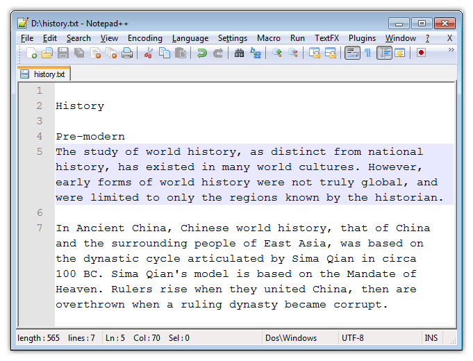
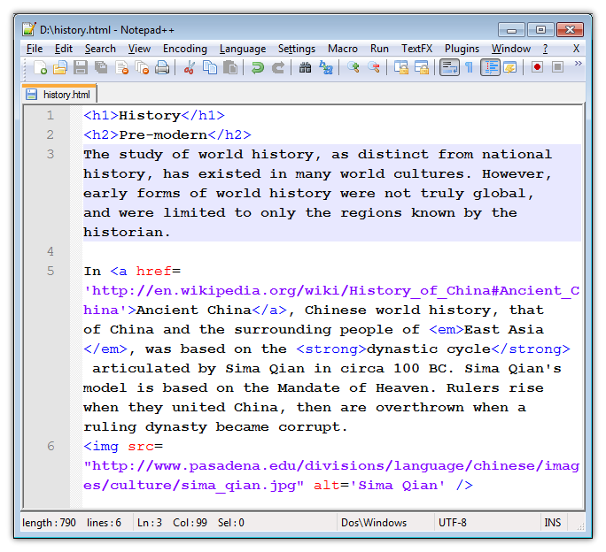
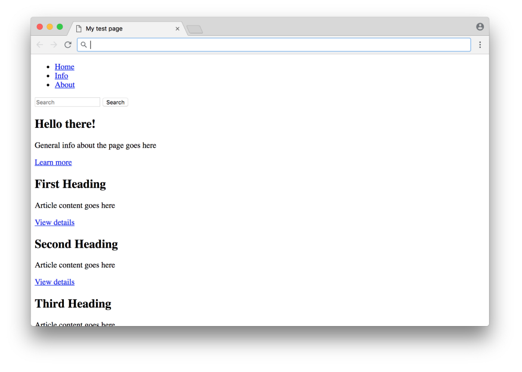
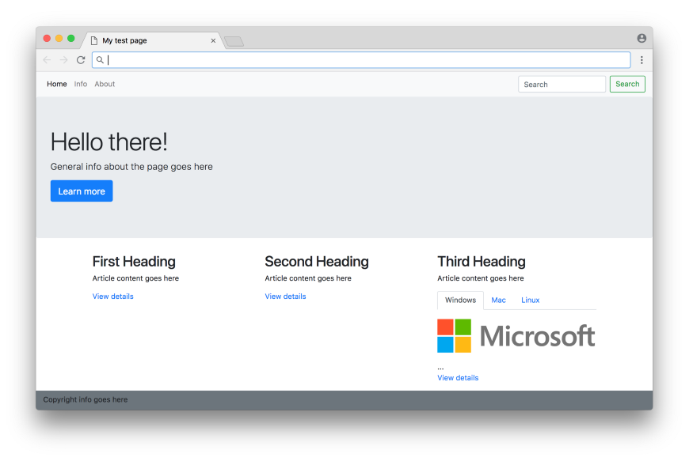
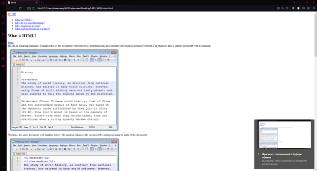
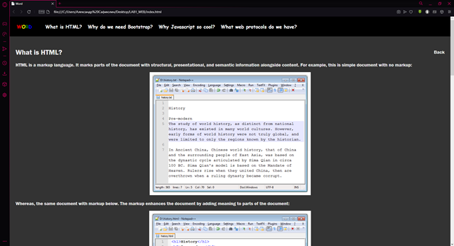

# Лабораторные работы

## Отчёт по лабораторным работам<br>По дисциплине "Разработка и поддержка веб-приложений"<br>студента группы ПА-18-2<br>Сафиюлина Александра

### Лабораторная работа №1

#### Постановка задачи:

1. Разработать гипертекстовую страницу. Использовать минимальное количество гипертекстовых тегов. Создать заголовок, содержание, название подразделов. Предусмотреть возвращение из любой точки страницы к содержанию.
2. Для даной странички создать каскадную таблицу стилей, которая позволяет изменить тип, цвет и размер шрифтов заголовков, подзаголовков и основного текста, выравнивание текста в документе, цвет фона и ссылок.

#### Выполнение:

Создание документа начнем с стандартных тегов `<!DOCKTYPE html>` и `html`. Внутри них создадим теги `<head>` и `<body>`. В первом разместим всю необходимую метаинформацию странички, заголовок сайта, а также ссылку на файл стилей, который в дальнейшем будет использован для написания таблицы стилей. В `<body>` будет размещена сама разметка сайта.

```html
<!DOCTYPE html>
<html lang="en">

<head>
    <meta charset="UTF-8">
    <meta name="viewport" content="width=device-width, initial-scale=1.0">
    <link rel="stylesheet" href="css/style.css">
    <title>Word</title>
</head>

<body>
</body>

</html>

```

Для удобства работы с стилями и разбиения на секции создадим внутри теги `<header>` и `<footer>`. В первом разместим следующий код:

```html

    <header>
        <!-- Link bar -->
        <div class="Header">
            <!-- Logo -->
            <div class="Word">
                <a href="#"><span style="color: red;">W</span><span style="color: yellow">O</span><span style="color: green;">R</span><span style="color: blue;">D</span></a>
            </div>

            <!-- Links-buttons -->
            <div class="MenuBar">
                <ul class="Menu">
                    <li><a href="#First">What is HTML?</a></li>
                    <li><a href="#Second">Why do we need Bootstrap?</a></li>
                    <li><a href="#Third">Why Javascript so cool?</a></li>
                    <li><a href="#Fourth">What web protocols do we have?</a></li>
                </ul>
            </div>
        </div>

    </header>

```

Использованные теги:
* `<div>` — блочный элемент, который предназначен для выделения фрагмента документа с целью изменения вида содержания;
* `<a>` — элемент, который предназначен для создания гиперссылок;
* `<span>` — элемент, который предназначен для удобного форматирования малых элементов документа:
* `<ul>` — элемент, который предназначен для создания маркированного списка;
* `<li>` — элемент, который предназначен для создания пунктов списка (необязательно маркированного).

Для того, чтобы в слове WORD каждая буква окрасилась в отдельный цвет, обрамим каждую букву отдельным `<span>` и укажем ей с помощью атрибутов CSS цвета.

Теперь перейдем к `<footer>`. Так принято называть нижнюю часть сайта, в которой размещают информацию про собственника сайта, лицензиях, ссылок и т.д. Код выглядит так:

```html

<footer class="Footer">
        <div class="Source">
            Links:
        </div>
        <div class="Links">
            <ul class="LinksList">
                <a href="http://fastwebstart.com/modern-html-tutorial/"><li>Fastwebstart.com</li></a>
                <a href="https://medium.com/actualize-network/modern-html-explained-for-dinosaurs-65e56af2981"><li>Medium.com</li></a>
                <a href="https://javascript.info/intro"><li>Javascript.info</li></a>
                <a href="https://www.goodcore.co.uk/blog/web-technologies/"><li>Goodcore.co.uk</li></a>
            </ul>
        </div>
</footer>

```

Весь контент сайта разместим в `<div>`. Ранее можно было заметить использование атрибута `class`. Он помогает обращаться к элементу из таблицы стилей CSS.

```html
    <div class="Content">
        <!-- First paragraph -->
        <div class="FirstParagraph" id="First">
            <div class="H2">
                <h2>What is HTML?</h2>
                <a href="#" class="Back">Back</a>
            </div>
            HTML is a markup language. It marks parts of the document with structural, presentational, and semantic information alongside content. For example, this is simple document with no markup:
            <div class="Image">
                
            </div>
            Whereas, the same document with markup below. The markup enhances the document by adding meaning to parts of the document:
            <div class="Image">
                
            </div>
            Note that parts of the HTML document are marked with constructs called tags to give better meaning to them. <i><b>&lt;h1&gt;</b></i> History <i><b>&lt;/h1&gt;</b></i> means it is a top level heading.
            The h1 tags surrounds the heading. <i><b>&lt;h2&gt;</b></i>Pre-modern<i><b>&lt;/h2&gt;</b></i> means it is a second level heading.
            The word “Ancient China” is Hyper linked to another document. The reader can follow that link to get more information on the topic. <i><b>&lt;img/&gt;</b></i> is used to embed an image in the document.
            This way, an HTML document gives an enhanced experience with hyper links, formatted text with images, video and audio.
            The world wide web is, in fact a collection of several millions of such inter-connected HTML documents hosted on websites.
        </div>

        <!-- Second paragraph -->
        <div class="SecondParagraph" id="Second">
            <div class="Text">
                <div class="H2">
                    <h2>Why do we need Bootstrap?</h2>
                    <a href="#" class="Back">Back</a>
                </div>
                If we take a look at the website that was created just with HTML, well, it seems to be like this one:
                <div class="Image">
                    
                </div>
                In order to spruce it up, we’ll add a CSS file to apply styling. Now if you’re not particularly good at CSS, it could take you many days to make this website look pretty.
                Instead of writing your own CSS, you could always use a CSS framework, which is essentially CSS that someone else wrote in a reusable manner.
                One popular CSS framework is Bootstrap, which came out in 2011 and quickly became adopted and used by literally millions of websites.
                Let’s see what the code would look like using Bootstrap:
                <div class="Image">
                    
                </div>
                Not bad! Note that in order to use a CSS framework like Bootstrap, you actually don’t need to write any CSS at all to get started
                — you just need to add the appropriate classes to the HTML to take advantage of the CSS that comes with the framework.
                Bootstrap became widely used because it helped with the major pain points of CSS at the time, such as browser inconsistencies and a lack of a proper grid system.
                <br><br>There are some downsides of using CSS frameworks like Bootstrap — in particular, they can be difficult to customize compared to writing CSS from scratch, which can make your website seem generic compared to others.
            </div>

        </div>

        <!-- Third paragraph -->
        <div class="ThirdParagraph" id="Third">
            <div class="Text">
                <div class="H2">
                    <h2>Why Javascript so cool?</h2>
                    <a href="#" class="Back">Back</a>
                </div>
                JavaScript was initially created to “make web pages alive”. The programs in this language are called scripts.
                They can be written right in a web page’s HTML and run automatically as the page loads. Scripts are provided and executed as plain text.
                They don’t need special preparation or compilation to run. In this aspect, JavaScript is very different from another language called Java.
                <br><br>
                When JavaScript was created, it initially had another name: “LiveScript”.
                But Java was very popular at that time, so it was decided that positioning a new language as a “younger brother” of Java would help.
                <br><br>
                Today, JavaScript can execute not only in the browser, but also on the server, or actually on any device that has a special program called the JavaScript engine.
                The browser has an embedded engine sometimes called a “JavaScript virtual machine”. Different engines have different “codenames”. For example:
                <div class="NumList">
                    <ol>
                        <li>V8 - Chrome and Opera</li>
                        <li>SpiderMonkey - Firefox</li>
                        <li>Chakra and Trident - Internet Explorer</li>
                        <li>SquirrelFish and Nitro - Safari</li>
                        <li>ChakraCore - Microsoft Edge</li>
                    </ol>
                </div>
                Modern JavaScript is a “safe” programming language. It does not provide low-level access to memory or CPU, because it was initially created for browsers which do not require it.
                JavaScript’s capabilities greatly depend on the environment it’s running in. For instance, Node.js supports functions that allow JavaScript to read/write arbitrary files, perform network requests, etc.
                JavaScript is the only browser technology that combines fully integration with HTML/CSS, simplicity and support by all major web-browsers. 
            </div>
        </div>

        <!-- Fourth paragraph -->
        <div class="FourthParagraph" id="Fourth">
            <div class="Text">
                <div class="H2">
                    <h2>What web protocols do we have?</h2>
                    <a href="#" class="Back">Back</a>
                </div>
                Web protocols are some predefined rules that must be followed by everyone communicating over the web. HyperText Transfer Protocol, better known as HTTP, is a web protocol that defines two concepts:
                how client requests are relayed to servers and how servers respond to client requests.
                <br><br>
                But there are some another protocols, that we must know such as Transmission Control Protocol (TCP), Internet Protocol (IP), User Datagram Protocol (UDP).
            </div>
        </div>
    </div>

```

Новые теги:
* `<br>` — элемент, который определяет отступ. Равно как и `<DOCKTYPE>` явяется однострочным тегом, то бишь его не нужно закрывать `</br>`;
* `<hi>` — элемент, который определяет строчный заголовок (i определяет уровень заголовка от 1 до 6);
* `<ol>` — элемент, который определяет нумерованный список;
* `<omg>` — элемент, который определяет изображение. Является однострочным.

Имеем в итоге такую страничку:


Добавим к файлу таблицы следующие код:

```css
/* Body style */
    body {
        background: #333333;
        color: #EEEEEE;
        margin: 0px;
        font-size: 20px;
        font-family: 'Franklin Gothic Medium', 'Arial Narrow', Arial, sans-serif;
        text-align: justify;
    }
    /* Footer style */
    footer {
        background: #000000;
        padding: 25px;
        font-family: cursive;
    }
    /* Hyperlinks style */
    a {
        text-decoration: none;
        color: #EEEEEE;
    }
    /* Style for logo div */
    div.Word {
        display: inline-block;
        margin: 10px 0px 0px 30px;
        text-align: center;
    }
    /* Style for header div of headers */
    div.H2 h2 {
        display: inline-block;
    }
    /* Style for back-link div of headers */
    div.H2 a {
        text-decoration: inherit;
        float: right;
        /* margin of h2 + 10px/2 of font-size difference */
        margin: 29.900px 0px;
    }
    /* Menu list style */
    ul.Menu {
        list-style: none;
        text-align: center;
    }
    /* Elements of menu style */
    ul.Menu li {
        display: inline-block;
        padding: 8px;
    }
    /* Links' elements style */
    ul.Menu li a {
        color: white;
        text-decoration: inherit;
    }
    /* Menu bar div style */
    div.MenuBar {
        display: inline-block;
    }
    /* Header div style */
    div.Header {
        background-color: black;
        font-weight: bold;
        font-size: 20px;
        font-family: cursive;
    }
    /* Images div style */
    div.Image {
        margin: 20px 0px;
        text-align: center;
    }
    /* Content div style */
    div.Content {
        margin: 25px;
    }
    /* Footer sources div style */
    footer div.Source {
        display: inline-block;
    }
    /* Footer links style */
    footer div.Links {
        display: inline-block;
    }
    /* Link lists style */
    ul.LinksList {
        list-style: none;
        /* to remove 40px padding-inline-start, that actually created from nothing */
        padding-inline-start: 0px;
    }
    /* Style for elements of link list */
    ul.LinksList li {
        display: inline-block;
        padding: 0px 0px 0px 8px;
    }

```

Для изменения цвета элемента мы используем атрибут `color`, для изменения цвета фона —  `background`. Чтобы поменять шрифт достаточно воспользоваться тегом `font-family`, для указания размера используют тег `font-size`. Для выравнивания текста —  `text-aligment`.

Теперь страница выглядит так:

